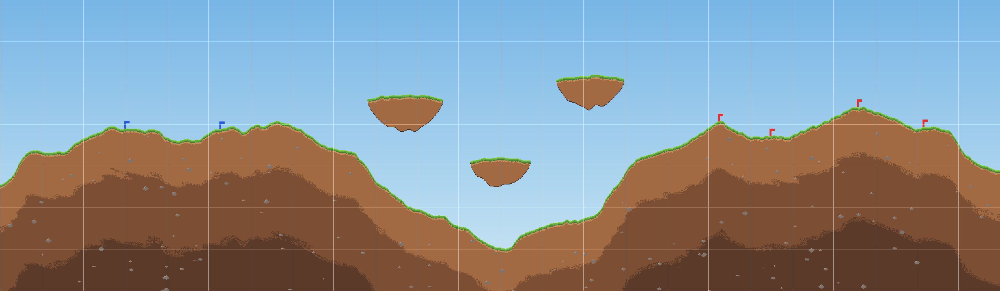

# TestTerrain — 테스트용 지형 (GDD 6·7장 기준)

미리보기는 2배 확대 + 하늘 배경 + 64px 청크 격자 + 스폰 깃발(파랑=플레이어, 빨강=AI). 실제 텍스처에는 하늘·격자·깃발이 없다.

## 파일
| 파일 | 용도 |
| --- | --- |
| `Assets/Art/Maps/TestTerrain.png` | 실제 지형 텍스처 (RGBA, 빈 공간 알파 0) |
| `Docs/Maps/TestTerrain_preview.png` | 확인용 미리보기 (Unity 임포트 대상 아님) |
| `Docs/Maps/gen_terrain.py` | 재생성 스크립트 (Python 표준 라이브러리만 사용, 시드 고정) |

## 규격
| 항목 | 값 |
| --- | --- |
| 크기 | 1536 × 448 px |
| 청크 | 64 × 64 px → 가로 24 × 세로 7 = 168개 |
| 화면 기준 | 1080p 4배 확대 가정 시 화면 1장 ≈ 480 × 270 px → 가로 약 3.2화면 |
| 지형 비율 | 약 48% (나머지는 투명) |
| 구성 | 왼쪽 언덕(플레이어) / 중앙 깊은 골짜기 / 오른쪽 언덕(AI) / 떠 있는 섬 3개 |
| 바닥 | 텍스처 맨 아래까지 지형, 파괴 불가 층 없음 → 끝까지 뚫으면 추락 |
| 좌우 끝 | 벽 없음 → 밀려나면 떨어짐 |

## 스폰 지점
좌표는 **텍스처 좌하단 원점(px)**, y는 지면 바로 위. 월드 좌표 = px ÷ PPU (텍스처 피벗이 좌하단일 때).

| 진영 | x | y | 지면 평탄도(±10px 내 높이차) |
| --- | --- | --- | --- |
| 플레이어 P1 | 192 | 250 | 1 |
| 플레이어 P2 | 338 | 249 | 3 |
| AI A1 | 1104 | 261 | 6 (약간 경사) |
| AI A2 | 1183 | 238 | 2 |
| AI A3 | 1317 | 283 | 2 (가장 높은 봉우리) |
| AI A4 | 1418 | 252 | 2 |

- 플레이어 ↔ 가장 가까운 AI 최소 거리: 766px (≥ 480px = 1화면, GDD 7장 충족)
- 섬 바닥과 아래 지면 사이 간격: 58 / 69 / 103px → 지면에서 점프로는 닿지 않는 엄폐·장애물 역할

## 권장 Import 설정 (직접 설정)
- Texture Type: Sprite (2D and UI)
- Filter Mode: Point (no filter)
- Compression: None
- Pixels Per Unit: 사용할 캐릭터 팩의 타일 크기와 동일하게 (Pixel Platformer 18 예상, 확인 필요)
- **Read/Write**: 파괴 지형 스파이크에 필요한 설정이다. 꺼져 있으면 런타임 픽셀 읽기/쓰기가 실패한다.

## 참고 수치 (PPU 18 가정)
| 항목 | px | 유닛 |
| --- | --- | --- |
| 맵 가로 | 1536 | 약 85.3 |
| 맵 세로 | 448 | 약 24.9 |
| 기본 포탄 폭발 반경 (1.5u) | 27 | 1.5 |
| 점프 높이 (1.5u) | 27 | 1.5 |

데드라인은 텍스처 바닥(y=0)보다 조금 아래에 두는 것을 권장한다 (정확한 값은 개발자 결정).
